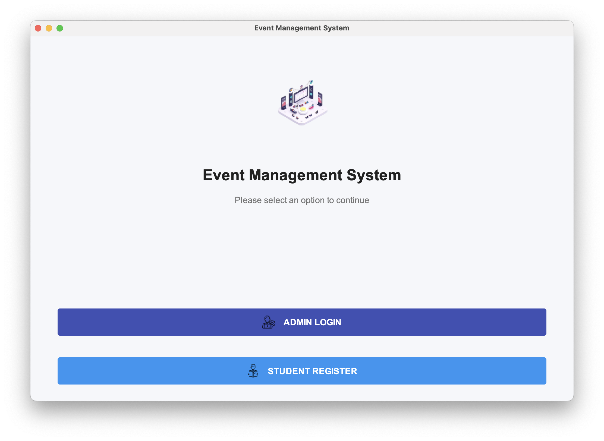
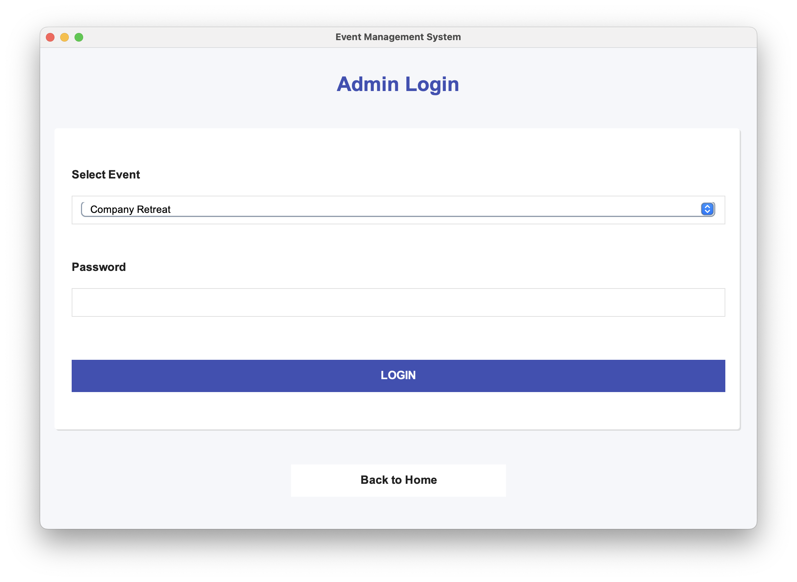
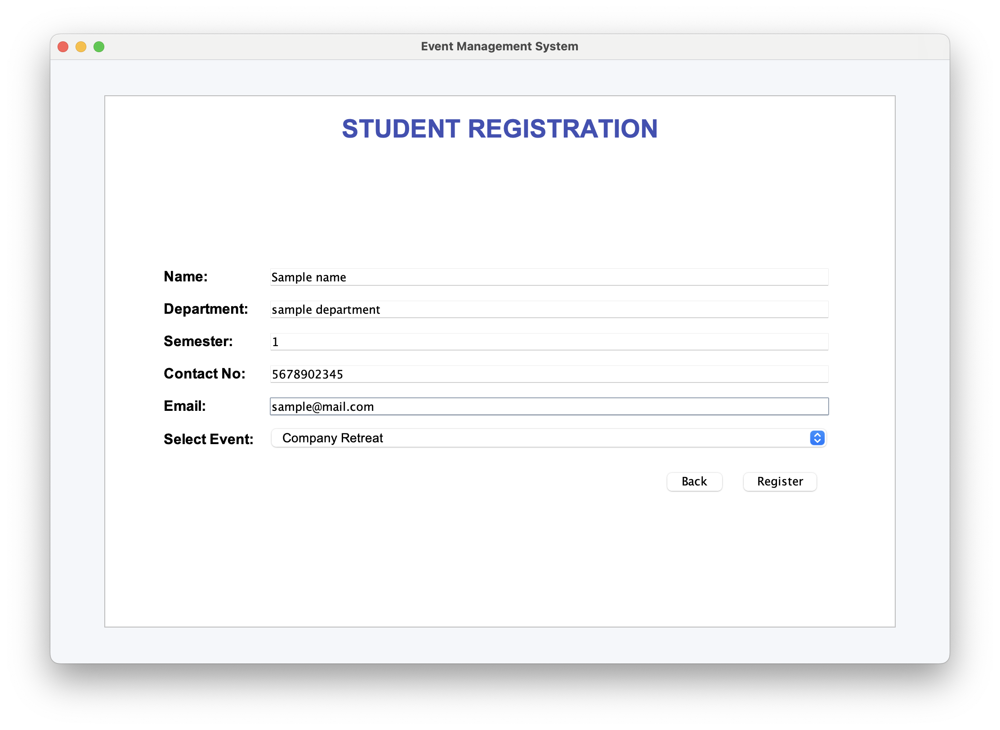
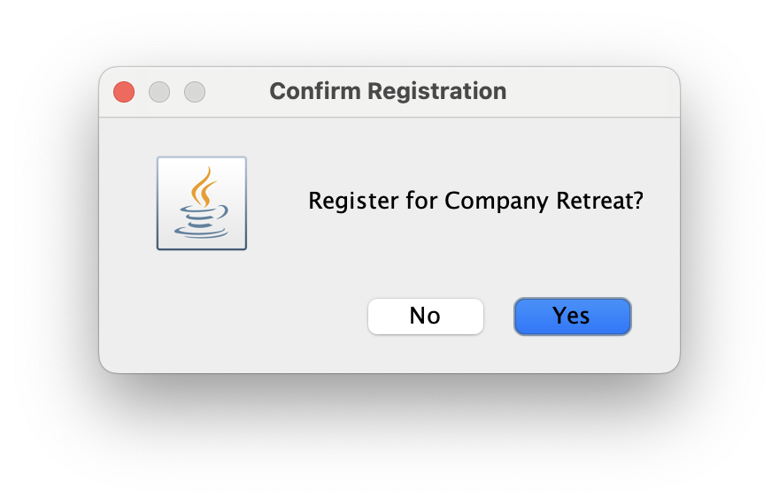
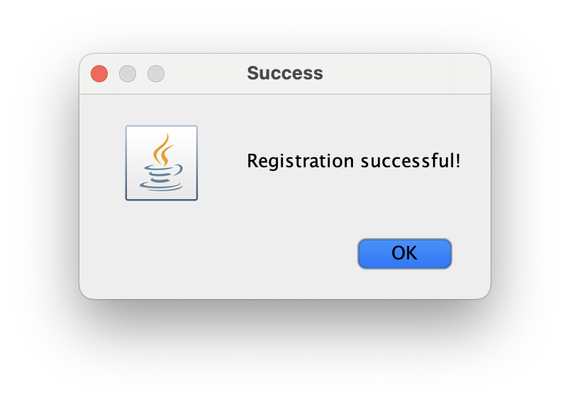

# 🎉 College Event Management System

A comprehensive Java Swing desktop application for managing college events, participant registrations, and event administration.

## ✨ Features

- **User Authentication**
  - Separate login for administrators and participants
  - Secure password handling

- **Event Management**
  - Create, view, update, and delete events
  - Track event details (name, description, date, location, capacity)
  - View event registrations

- **Participant Registration**
  - Easy event registration for students
  - View registered events
  - Participant information management

- **Admin Dashboard**
  - Manage all events
  - View and manage participant registrations
  - Generate reports

## 🛠️ Technologies Used

- **Frontend**: Java Swing, AWT
- **Backend**: Java 11
- **Database**: MySQL
- **Build Tool**: Maven
- **Dependency Management**: Maven
- **JDBC**: MySQL Connector/J

## 📋 Prerequisites

- Java Development Kit (JDK) 11 or later
- MySQL Server 8.0 or later
- Maven 3.6.0 or later
- Git (optional, for version control)

## 🚀 Getting Started

### 1. Clone the Repository
```bash
git clone https://github.com/Sheldon1999/Event_Management.git
cd Event_Management
```

### 2. Database Setup
1. Ensure MySQL server is running
2. Create a new MySQL user (or use existing one):
   ```sql
   CREATE USER 'superadmin'@'localhost' IDENTIFIED BY 'Super@1999';
   GRANT ALL PRIVILEGES ON *.* TO 'superadmin'@'localhost' WITH GRANT OPTION;
   FLUSH PRIVILEGES;
   ```
3. Update database configuration in `src/main/resources/config.properties`

### 3. Build the Project
```bash
mvn clean install
```

### 4. Run the Application
```bash
java -jar target/EventManagement-1.0-SNAPSHOT.jar
```

## 📂 Project Structure

```
src/main/java/com/eventmanagement/
├── config/          # Application configuration
├── controllers/      # Application controllers
├── exceptions/       # Custom exceptions
├── models/           # Data models (Participant, Event, User)
├── repositories/     # Data access layer
│   └── impl/        # JDBC implementations
├── services/         # Business logic
└── ui/               # Swing UI components
```

## 🔧 Configuration

Configure the application by editing `src/main/resources/config.properties`:

```properties
# Database Configuration
db.url=jdbc:mysql://localhost:3306/event_management?useSSL=false&serverTimezone=UTC
db.username=superadmin
db.password=Super@1999

# Application Settings
app.name=College Event Management
app.version=1.0.0
```

## 📝 Usage

1. **Home Screen**
   - Choose between Admin Login or Student Registration

2. **Admin Login**
   - Username: admin
   - Password: admin123 (change in production)
   - Manage events and view registrations

3. **Student Registration**
   - Register for available events
   - View registered events
   - Update personal information

## 📊 Database Schema

### Participants Table
```sql
CREATE TABLE IF NOT EXISTS participants (
    id BIGINT AUTO_INCREMENT PRIMARY KEY,
    name VARCHAR(100) NOT NULL,
    email VARCHAR(100) NOT NULL,
    phone VARCHAR(20) NOT NULL,
    department VARCHAR(50) NOT NULL,
    semester INT NOT NULL,
    event_id BIGINT NOT NULL,
    registration_date TIMESTAMP DEFAULT CURRENT_TIMESTAMP,
    FOREIGN KEY (event_id) REFERENCES events(id) ON DELETE CASCADE
);
```

### Events Table
```sql
CREATE TABLE IF NOT EXISTS events (
    id BIGINT AUTO_INCREMENT PRIMARY KEY,
    name VARCHAR(100) NOT NULL,
    description TEXT,
    start_date_time DATETIME NOT NULL,
    end_date_time DATETIME NOT NULL,
    location VARCHAR(100) NOT NULL,
    max_participants INT,
    created_at TIMESTAMP DEFAULT CURRENT_TIMESTAMP,
    updated_at TIMESTAMP DEFAULT CURRENT_TIMESTAMP ON UPDATE CURRENT_TIMESTAMP
);
```

## 📸 Screenshots

### Home Page

*Figure 1: Application Home Page*

### Admin Login

*Figure 2: Admin Login Page*

### Student Registration

*Figure 3: Student Registration Form*

### Registration Confirmation

*Figure 4: Registration Confirmation Dialog*

### Success Message

*Figure 5: Operation Success Notification*

## 🤝 Contributing

1. Fork the repository
2. Create your feature branch (`git checkout -b feature/AmazingFeature`)
3. Commit your changes (`git commit -m 'Add some AmazingFeature'`)
4. Push to the branch (`git push origin feature/AmazingFeature`)
5. Open a Pull Request

## 📄 License

This project is licensed under the MIT License - see the [LICENSE](LICENSE) file for details.

## 📧 Contact

For any queries, please contact ankur999gangwar@gmail.com or open an issue in the repository.

---

<div align="center">
  Made with ❤️ using Java Swing
</div>